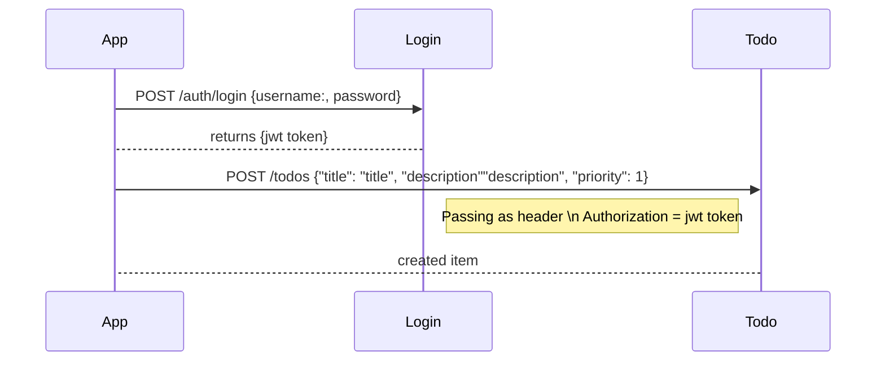

# TODOs RESTful API

[](https://gitlab.com/gutmox/money-transfers/commits/master)

[](https://gitlab.com/gutmox/money-transfers/commits/master)

Persistent RESTful API for a “TODO” application. 

## Swagger API Definition

* https://app.swaggerhub.com/apis/gutmox/ToDo_Rest_API/1.0.0 

  
 

## Project structure Layout

```
.
├── gradle                              - gradle wrapper
│   └── wrapper
├── docs                                - Swagger API doc
├── src/main/java                       - Source code
├── src/test/java                       - Unit tests
└── src/integration-test/java           - Integration tests 

```

## Package organisation

|package   	    | description|
|---	        |---	            |
|com.gutmox.todos.api    | Java API definition|
|com.gutmox.todos.api.impl    | Java API implementation|
|com.gutmox.todos.api.repositories    | repositories api|
|com.gutmox.todos.api.repositories.mongo    | repositories implementation on MongoDb|
|com.gutmox.todos.api.validations    | Validations classes to be used in composition from services implementacion|
|com.gutmox.todos.auth.*    | under this package structure are the login, logout, sign up and authentication classes, following a similar structure than the todo resources|
|com.gutmox.todos.config    | the configuration utils are centralised under this package|
|com.gutmox.todos.guice    | One class I had to add to glue guice with vert.x|
|com.gutmox.todos.handlers     | Vert.x Handlers to deal with request, organised by rest method|
|com.gutmox.todos.handlers.factory | centralised all the todo handlers creation|
|com.gutmox.todos.routing | Vert.x router configuration whith all endpoints and methods|
|com.gutmox.todos.verticles | Vert.x verticles|
|com.gutmox.todos.vertx.tools | a helper class to make easy run vert.x|

## Example /todos POST Sequence



## Built With

* [Java 8](http://www.oracle.com/technetwork/java/javase/10-relnote-issues-4108729.html) - Code language 
* [Vert.x Web + Vert.x](https://vertx.io) - Reactive library
* [Google guice](https://github.com/google/guice) - Dependency injection library
* [Gradle](https://gradle.org) - Build tool

### Unit Testing

* [JUnit 4](https://junit.org/junit4/) - Junit
* [Mockito](http://site.mockito.org)   - Mocking 
* [AssertJ](http://joel-costigliola.github.io/assertj/index.html) - adds fluent assertion support


## Running It manually

```
./mongo-start.sh

```

and from the IDE, run the main class:

```
    com.gutmox.todos.Runner
```

## Running tests

### Unit tests
    
```
    gradle clean test
```

### Integration tests

```
    gradle clean execMongo test stopMongo -Dtest.profile=integration
```

## Building
```
    gradle clean build
```

## Docker

### To build:

```
    docker build -t todos 
 ```
### To run:

```
    docker run -t -i -p 8080:8080 todos
```

## Sonar

### Report

[sonarcloud report](https://sonarcloud.io/dashboard?id=money-transfers)

### Running it locally

``` 
 gradle sonarqube \
  -Dsonar.organization=gutmox-github \
  -Dsonar.host.url=https://sonarcloud.io \
  -Dsonar.login=xxxx

```